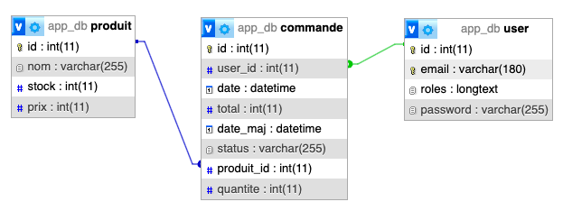

# Symfony Stocks Manager

## Description

L'application présente un système simple de commandes de produits et gestion des stocks.

### Schema de la base

### Workflow de gestion des commandes

## Missions

L'objectif est de gérer/automatiser avec des évènements les tâches suivantes :
 - Automatiser la gestion des stocks
 - Construire des logs de suivi de commandes
 - Construire des logs des authentification permettant d'afficher sur le dashboard admin les tentatives de logs echouées ou suspectes

## Ressources

